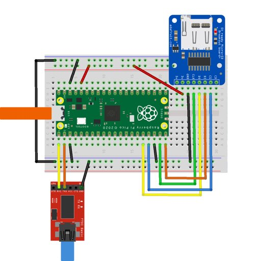

# The Raspberry Pi Pico port

## Introduction

The Raspberry Pi Pico is a very small and very cheap microcontroller board
based around the Raspberry Pi Foundation's RP2040 chip. It's got two Cortex-M0+
cores, 2MB of onboard NAND flash which can be used for code via a demand-paging
system, and 264kB of RAM.

The Fuzix port is a pico-sdk application spawning a real-time thin layer on top of which
Fuzix runs in soft-irq mode and cooperative multitasking mode, with the root filesystem
on USB (optional), SD card (optional) or (as fallback) on the internal NAND.
It starts with both console and tty1 over UART0 and will install multiple USB devices on host;
once a terminal connects on USB CDC devices, the UART0 will be free for user applications.
There's enough memory to run five or six processes at once in swapless mode (default), 
and you can enable swapping to USB or SD card for up to 15.

## Building and installation

You need to install the [Raspberry Pi Pico SDK](https://www.raspberrypi.org/documentation/pico/getting-started/).

```
cd Kernel/platform-rpipico_rt
vi Makefile
# At this point, you need to edit the Makefile to tell it where the Raspberry Pi Pico SDK lives.
make image -j
```

You should now end up with:
* `build/fuzix.uf2`, the kernel
* `build/root.flash.uf2`, the root filesystem for flash

Both the `uf2` files must be flashed onto the Pico in the usual way (i.e. connect it up as a mass storage device and copy the files on);
alternatively, you can use OpenOCD.
If it doesn't work after the second file has been flashed in, run the flash_nuke example from pico-examples repository in order to clean the flash;
then upload both files again.

Once the board has rebooted it will appear as a USB serial devices which you can connect to. Alternatively, connect a terminal to UART0 on the Pico.

## Default setup

Out of the box:

  - /dev/hda is the NAND flash, containing the root filesystem. It can be
	partitioned but there's no real point, so it isn't.

  - /dev/hdb is the SD card. Fuzix understands DOS partition tables. It's not
	hot swappable as the SD card is only probed at boot time.

  - /dev/hd{c,d,e} are the 3 USB virtual disks. (NOTE: not implemented yet)

SD card default pins:

        Pico pin     RP2040 pin    SD card pin
        --------------------------------------
           16           12            MISO
           17           13             CS
           19           14            SCK
           20           15            MOSI

Remember to also connect the SD card's GND to any ESP8266 GND pin and Vcc to
3.3V. Not 5V, or it won't work.

The console is accessible either via UART0 (at 115200 baud) or by connecting
the Pico up via USB to a PC, at which point it'll present itself as a few standard
USB CDC serial devices and a few USB Vendor devices.
USB CDC0 is Fuzix's tty1, USB CDC1 is Fuzix's log device (accessible in-system on tty2),
USB CDC2 is Fuzix's tty3 for user applications. USB CDC3 isn't mapped on Fuzix's ttys
and it is available for user applications relying on pico-sdk only.
USB Vendor0 is Fuzix's binary multiplexer for external filesystem and other purposes.
USB Vendor1 it is available for user applications using Fuzix's code.
USB Vendor2 isn't mapped on Fuzix and it is available to user applications relying on pico-sdk only.
Both USB CDC3 and USB Vendor2 can be reconfigured as other USB classes.

**Note:** when using the USB console, you're unlikely to be able to connect
quickly enough after boot to see the startup messages. Most likely when you
connect, the Pico will be sitting waiting at the prompt to set the time. Press
RETURN a few times to get to the getty login prompt.



# Advanced installation options

You have also:
* `build/root.img`, the root disk for SD and USB (same contents of root.flash.uf2 in a bigger filesystem)
* `build/swap.img`, the swap disk for SD and USB
* `build/scratch.img`, a scratch disk for any purpose

The three img files generated by default are all 32MB long, suitable both
for USB and SD use. Note that 32MB is the current maximum disk size.
You can dd any of the files to your SD card or run `pyco.py` utility to serve
those disks via USB. To use the USB disks, run `pyco.py` first, then reboot Pico.

## In-system format

To format a file system from the Fuzix shell:
```
$ mkfs -f /dev/hdb1 32 65535
```
Second argument is the number of inodes. The last argument is the filesystem size in 512-byte blocks.

## Swap

Out of the box, Fuzix runs in swapless mode. This gives enough memory to run
most normal programs (you can use `free` to see how much you have left). If you
want more, you can enable swapping to the SD card.

To do this, create a partition of up to 2048kB (4096 blocks) on the SD card.
Then use the `swapon` command to enable swap. You can see swap usage with
`free`.

```
# fdisk -l
                      START                  END
Device    Boot  Head Sector Cylinder   Head Sector Cylinder  Type  Sector count

/dev/hdb1        33      3        0     38      6        1    83          4096
/dev/hdb2        38      7        1     58      8       18    83         65536
# swapon /dev/hdb1 4096
# free
         total         used         free
Mem:       160           56          104
Swap:     2048            0         2048
# 
```

You can't turn swap off again.

You probably can swap to the NAND flash, but it's a terrible idea: you might wear out
the flash memory after just a few hours, leaving your Pico lifeless.

## Using the NAND flash

The Pico's built-in NAND flash is mapped via the Dhara FTL library,
so you get proper wear levelling.  The FTL library requires empty flash sectors
to work efficiently; the Fuzix filesystem has trim support, so the FTL library
gets notified when sectors become free, but if the filesystem gets very full
and Dhara runs out it can get extremely slow as it constantly does garbage
collection.

# Userland

The first thing you probably want to do is `stty erase '^?'` to make the DELETE
key in your terminal work properly. (Use the `levee` editor to add it to
`$HOME/.profile`.)

The Pico Fuzix port runs generic Cortex M0 ELF pie binaries, which are
theoretically portable to other ARM or Cortex devices, but this hasn't been
tried yet. There's 64kB available for both code and data; the system call
interface uses `svc`.

The Pico's mask ROM contains many useful routines which can be used instead of
libgcc, which would reduce the binary size. This hasn't been done yet because
it would render the binaries non-portable.

There's a Forth interpreter as `fforth` (use capital letters) and some games
are in `/usr/games`.

You can customized the filesystem by modifing the `update-flash.sh` script 
to include/exclude libraries and other binaries existing and built by default
from `[FUZIX]/Library` and `[FUZIX]/Applications`.

# Issues

There are many, the biggest of which are:

  - CPU exceptions should be mapped to signals.

...and probably others.

# Postscript

dg@cowlark.com
